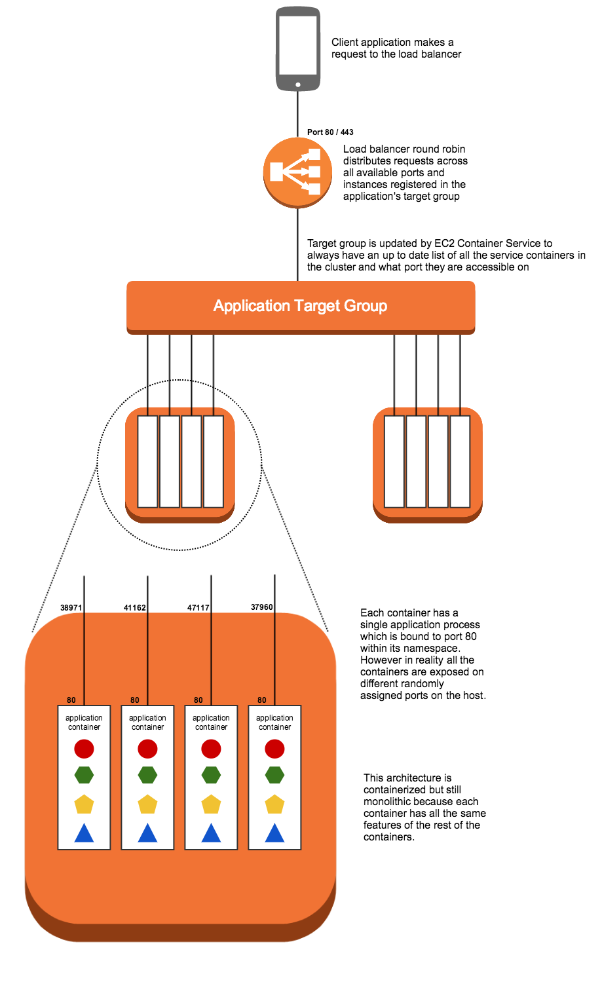

## Deploying in containers

Here we take our node application and put it into a container for deployment on EC2 Container Service.




## Application Changes for Docker

1. __Single process instead of `cluster`.__ The first and biggest change involved with containerizing this application is getting rid of `cluster`. With docker containers the goal is to run a single process per container, rather than a cluster of processes.

   The reason for this change is that a lighweight container with a single process in it allows for greater granularity and flexibility in container placement onto infrastructure. A large container that has four processes in it and requires four cores of CPU power can only be run on an instance of a particular size. However by breaking that up into four containers that each have a single process in them we can now make use of two smaller instances that will each run two containers, or even four tiny instances that will each run a single container. Or we could go the opposite direction and easily run 64 of these small containers on a single massive instance.

2. __Create `Dockerfile`:__ This file is basically a build script that creates the container. The base container that the dockerfile starts from contains a specific version of node.js. Then the rest of the commands add both the application code and the `node_modules` folder into the container. The result is a container image that is a reliable unit of deployment. The container can be run locally, or run on a remote server. It will run the same in both places.

## Deployment

1. Launch an ECS cluster using the Cloudformation template:

   ```
   $ aws cloudformation deploy \
   --template-file infrastructure/ecs.yml \
   --region <region> \
   --stack-name <stack name> \
   --capabilities CAPABILITY_NAMED_IAM
   ```

2. Deploy the services onto your cluster: 

   ```
   $ ./deploy.sh <region> <stack name>
   ```
